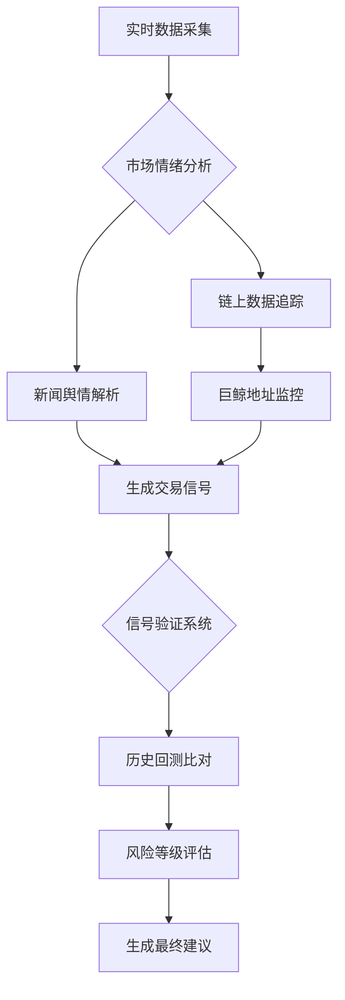
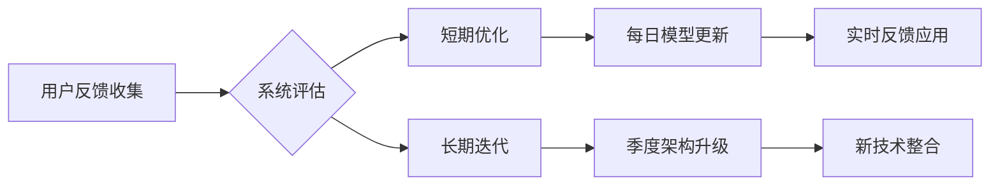

# Bitget推出GetAgent：AI如何重塑加密货币交易体验

## 加密交易迈入智能对话时代

全球领先的加密货币交易平台Bitget于2025年7月正式发布革命性产品——GetAgent人工智能交易助手。这款创新工具将复杂的市场分析转化为自然语言对话，标志着加密交易正式迈入智能化新纪元。

👉 [体验智能交易新纪元](https://bit.ly/okx_welcome)

### GetAgent的核心优势

1. **实时交互式分析**
   - 价格波动即时响应
   - 技术指标自动解读
   - 市场新闻智能筛选

2. **个性化交易洞察**
   - 基于用户历史持仓的定制建议
   - 动态调整风险预警阈值
   - 智能推荐交易机会

3. **全时段智能监控**
   - 24/7追踪全球市场动态
   - 多资产组合同步管理
   - 异常波动即时推送提醒

### 技术架构解析

GetAgent采用三层智能引擎架构：
| 模块 | 功能 | 技术支撑 |
|------|------|----------|
| 数据层 | 实时行情抓取 | 全球30+交易所API |
| 分析层 | 多维指标计算 | 深度学习模型+传统技术分析 |
| 交互层 | 自然语言处理 | 基于Llama3的定制化大模型 |

该架构确保每秒可处理超过500万次数据请求，响应延迟控制在200ms以内。

## 智能助手如何改变交易生态

### 传统交易VS智能交易

传统模式痛点：
- 需同时操作多个分析工具
- 人工解读技术指标易出错
- 信息过载导致决策延迟

GetAgent解决方案：
1. 整合行情、新闻、社交情绪等多维数据
2. 自动识别关键交易信号（如RSI超买超卖）
3. 生成可执行的交易建议

👉 [获取智能交易指南](https://bit.ly/okx_welcome)

### 典型应用场景

**案例1：波动行情捕捉**
当ETH价格出现异常波动时：
1. 系统自动识别波动源（链上大额转账/交易所套利）
2. 结合历史数据预测短期走势
3. 推送"建议在$3,150上方建立多单"的可执行指令

**案例2：组合风险管理**
用户持仓包含BTC、SOL、MEME币：
1. 实时评估各资产风险等级
2. 发现MEME币波动率超阈值
3. 发出"建议减仓30%并设置动态止盈"的智能提醒

## 核心功能深度解析

### 智能信号系统

GetAgent的信号生成机制：

### 个性化配置体系

用户可自定义参数：
- 风险偏好（保守/平衡/激进）
- 交易频率（日内/波段/长线）
- 资产偏好（主流币/山寨币/Meme币）

系统会根据这些参数动态调整：
- 技术指标权重（RSI:MACD:布林带比例）
- 新闻过滤规则
- 预警触发阈值

## 行业影响与未来展望

### 对交易者的价值

| 维度 | 传统交易者 | GetAgent用户 |
|------|------------|--------------|
| 分析时间 | 平均2-3小时/日 | 实时响应 |
| 信号准确率 | 60-70% | 85%+（测试数据） |
| 决策速度 | 15-30分钟 | 即时推送 |
| 情绪干扰 | 明显 | 系统化规避 |

### 未来升级路线图

2025Q3：
- 推出移动端独立应用
- 集成DeFi收益优化功能

2025Q4：
- 支持多语言交互（英语/中文/韩语）
- 上线社交交易模块

2026：
- 引入量子计算优化模型
- 拓展至传统金融市场（外汇/黄金）

👉 [抢先体验未来交易](https://bit.ly/okx_welcome)

## 常见问题解答

**Q：GetAgent是否需要编程或技术背景？**  
A：完全无需任何技术基础，用户只需通过自然语言提问即可获取专业分析。

**Q：如何获取访问权限？**  
A：目前采用邀请制，Bitget注册用户可通过官网申请测试资格。

**Q：系统建议的准确性如何保障？**  
A：所有建议均基于历史数据回测和实时市场验证，但加密市场存在波动风险，建议结合自身风险承受能力决策。

**Q：是否支持模拟交易验证？**  
A：内置模拟交易模块，用户可先用虚拟资金验证策略有效性。

**Q：能否自定义交易信号的推送方式？**  
A：支持邮件/站内信/移动推送三种方式，可单独设置每个交易对的提醒规则。

## 安全与合规保障

Bitget为GetAgent构建了多重防护体系：
1. **数据隔离**：交易数据与分析系统物理隔离
2. **权限管控**：采用ABAC动态访问控制
3. **审计追踪**：所有操作记录区块链存证
4. **隐私保护**：通过零知识证明技术处理敏感信息

平台已通过ISO 27001认证，并获得塞舌尔、新加坡等地的金融牌照。

## 行业专家观点

"这种AI原生的交易方式将重新定义市场参与门槛"  
—— 数字资产研究院高级分析师 李维

"关键创新在于将非结构化数据转化为可执行指令"  
—— 前Coinbase工程师 王子昂

"需要警惕过度依赖算法的风险，但不可否认这是重要进步"  
—— 金融科技伦理委员会成员 陈思远

## 使用技巧与建议

1. **构建有效提问模板**  
   - "BTC/USDT在当前RSI值下，历史回测结果如何？"
   - "帮我评估SOL链上大额转账对价格的影响"

2. **设置智能提醒示例**  
   - "当ETH链上活跃地址突破50万时提醒"
   - "监控MEME币板块市值占比变化"

3. **组合使用策略**  
   - 早盘：获取市场情绪报告
   - 中午：执行仓位优化建议
   - 晚间：复盘当日交易信号准确性

## 持续优化机制

GetAgent采用双循环优化架构：

