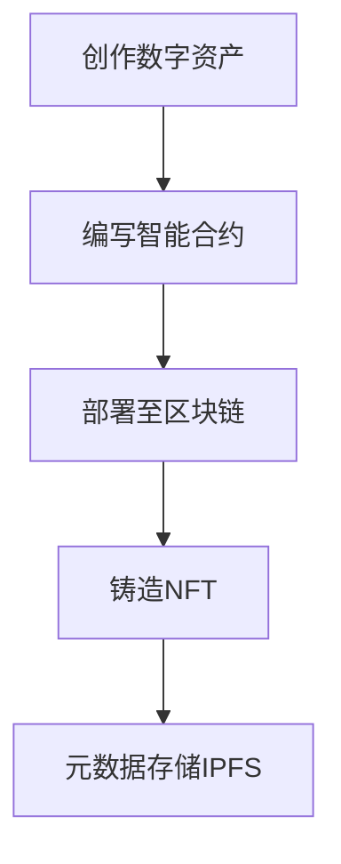

# NFT已死？深度剖析行业现状、挑战与未来走向

## 引言：NFT的崛起与争议
近年来，**NFT**（非同质化代币）作为区块链技术的创新应用，彻底改变了数字资产的拥有与交易方式。从数字艺术品到虚拟房地产，NFT赋予了每个数字资产独一无二的身份标识。然而，随着市场交易量下滑、价格暴跌，行业内外开始质疑：NFT是否已走向衰亡？

👉 [探索NFT新机遇](https://bit.ly/okx_welcome)

## NFT的核心价值解析

### 1.1 NFT的定义与技术特征
NFT的三大核心特征使其区别于传统数字资产：
- **唯一性**：每个NFT通过区块链哈希值实现不可复制
- **不可分割性**：最小单位为1，如虚拟土地不可拆分交易
- **可验证性**：交易记录永久存储于分布式账本

以数字艺术品为例，创作者可通过NFT技术实现：
| 传统模式缺陷 | NFT解决方案 |
|--------------|-------------|
| 作品易盗版 | 区块链确权 |
| 中心化平台抽成 | 点对点交易 |
| 无法追溯历史 | 链上透明记录 |

### 1.2 技术架构深度解析
NFT生态依赖三大技术支柱：
1. **区块链网络**：以太坊ERC-721/ERC-1155标准奠定基础
2. **智能合约**：自动执行交易规则，如创作者版税分成
3. **分布式存储**：IPFS确保元数据永久可访问

开发流程示例：

### 1.3 发展历程里程碑
- **2017年**：CryptoPunks开启像素艺术时代
- **2021年**：Beeple作品拍出6900万美元
- **2022年**：NFT总市值突破400亿美元
- **2023年**：市场调整期，总市值回落至100亿美元

👉 [参与NFT市场变革](https://bit.ly/okx_welcome)

## 当前市场全景透视

### 2.1 关键数据指标（2024Q1）
| 指标                | 数据对比               |
|---------------------|------------------------|
| OpenSea月交易量     | 从26亿美元降至1.95亿   |
| 活跃钱包数量        | 较峰值下降60%          |
| BAYC地板价          | 从150ETH跌至25ETH      |
| 新项目上线量        | 同比减少45%            |

### 2.2 跨领域应用场景
**数字艺术**：Beeple作品验证艺术确权革命  
**游戏产业**：Axie Infinity构建Play-to-Earn生态  
**音乐发行**：3LAU通过NFT实现专辑直接销售  
**体育收藏**：NBA Top Shot激活粉丝经济

### 2.3 顶级项目生态分析
| 平台        | 核心优势                | 市场份额 |
|-------------|-------------------------|----------|
| OpenSea     | 多链支持/品类最全       | 45%      |
| CryptoPunks | 文化符号/蓝筹资产       | 18%      |
| BAYC        | 社群运营/品牌衍生能力   | 22%      |

## 行业挑战与破局之道

### 3.1 市场质疑焦点
**泡沫论**：投机行为导致价格偏离实际价值  
**技术瓶颈**：以太坊网络拥堵致单笔手续费超$300  
**安全风险**：2022年NFT相关黑客攻击损失超$20亿

### 3.2 创新解决方案
- **Layer2扩展**：Polygon网络使交易成本降低90%
- **跨链协议**：Wormhole实现资产互通
- **元数据保险**：Arweave提供永久存储解决方案

## 未来发展趋势前瞻

### 4.1 新兴应用场景
- **数字身份认证**：学历证书NFT化防伪
- **供应链溯源**：奢侈品NFT实现全流程追踪
- **元宇宙基建**：Decentraland土地NFT交易量年增300%

### 4.2 长期价值支撑
| 领域        | 价值体现                  |
|-------------|---------------------------|
| 数字艺术    | 版权收益自动化分配        |
| 游戏经济    | 真正资产所有权            |
| 社交身份    | 去中心化数字身份标识      |

### 4.3 投资者行动指南
1. **项目评估框架**：
   - 技术团队背景核查
   - 应用场景可行性分析
   - 社区活跃度监测
2. **风险分散策略**：
   - 配置比例不超过数字资产的30%
   - 蓝筹项目与潜力项目7:3分配

👉 [把握NFT投资机遇](https://bit.ly/okx_welcome)

## FAQ：行业核心问题解答

**Q1：NFT市场是否已彻底崩盘？**  
A：当前处于调整期，活跃地址数仍保持10万+/日，优质项目抗跌性强

**Q2：如何辨别优质NFT项目？**  
A：关注团队透明度、实际应用场景、社区运营能力三要素

**Q3：NFT未来会与AI结合吗？**  
A：AI生成艺术+NFT确权已成趋势，Midjourney用户超200万

**Q4：监管政策对NFT影响几何？**  
A：新加坡、迪拜等地区已出台友好政策，合规化助推行业复苏

**Q5：普通人如何参与NFT投资？**  
A：从百元级入门项目开始，优先选择Gas费低廉的Solana、Polygon链

## 结语：在变革中寻找机遇
NFT正在经历从炒作到价值回归的必然过程。对于创作者，这是数字版权保护的新纪元；对于投资者，调整期的优质资产更具配置价值。随着Web3.0基础设施的完善，NFT将在数字身份、资产确权等领域发挥更大作用。把握技术创新与应用场景的结合点，方能在行业洗牌中赢得先机。