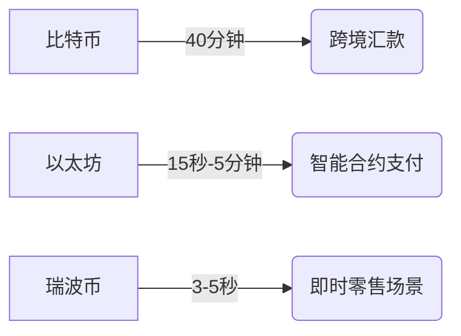

# 最适合支付的加密货币推荐及选择指南

## 选择加密货币支付的核心标准

加密货币作为新型支付工具逐渐普及，但不同币种在支付场景中的表现差异显著。本文从商户视角出发，通过四大核心标准解析优质支付货币的选择逻辑，并结合市场实践推荐前五名优质币种。

### 稳定性保障支付安全
加密货币的**价格波动性**直接影响支付安全性。以比特币为例，2023年单日最大跌幅曾达15%，这种波动性导致商户面临资产缩水风险。稳定币通过锚定法币（如美元/欧元）或大宗商品，有效解决这一问题：

| 稳定币类型 | 典型代表 | 锚定机制 | 优势领域 |
|---------|---------|---------|---------|
| 法币抵押 | USDT、BUSD | 1:1美元储备 | 跨境支付 |
| 加密抵押 | DAI | ETH超额抵押 | DeFi场景 |
| 算法稳定 | FEI | 协议控制 | 高频交易 |

> 📌 关键数据：Visa与万事达卡的加密卡交易中，稳定币占比超73%

### 交易成本对比分析
高频交易场景下，手续费差异显著影响利润空间。以1000笔交易为例：
- 比特币：约$2,080（$2.08/笔）
- 以太坊：约$837（$0.84/笔）
- 瑞波币：约$10（$0.01/笔）
- 纳诺币：完全免费

👉 [了解主流支付平台手续费详情](https://bit.ly/okx_welcome)

### 交易速度决定体验
不同区块链的确认时间直接影响支付效率：

### 用户基数构建生态闭环
PayPal数据显示，支持加密支付的商户数量季度环比增长23%，但币种选择需匹配目标客群：
- 东南亚市场：泰达币（USDT）使用率超68%
- 欧美市场：BUSD渗透率达41%
- 非洲新兴市场：Stellar（XLM）覆盖35%无银行账户人群

## 五大优质支付币种解析

### 1. 泰达币（USDT）
作为全球流通量最大的稳定币，其优势体现在：
- 日均交易量超$650亿（CoinGecko数据）
- 支持15+区块链网络
- 被Overstock、Newegg等超3000家商户接受
- 跨境汇款成本较传统方式降低70%

### 2. 瑞波币（XRP）
跨境支付领域的领跑者：
- 被300+金融机构采用（SWIFT竞争对手）
- 单笔交易成本$0.0001
- 交易确认时间3.8秒
- 支持40+法币兑换通道

### 3. 纳诺币（NANO）
零手续费支付解决方案：
- 采用区块网格架构，支持无限扩展
- 日均处理10万+笔交易
- 适合微支付场景（如数字内容打赏）
- 碳中和认证区块链

### 4. 星云币（XLM）
普惠金融的实践者：
- 世界银行合作开发跨境支付系统
- 支持资产发行功能
- 非洲地区用户超5000万
- 交易速度3秒，手续费$0.00001

### 5. 币安美元（BUSD）
合规化支付新势力：
- 美国NYDFS监管认证
- 每月链上活跃地址增长15%
- 支持DeFi质押生息
- 被Binance Pay集成至200+国家

## 潜力币种推荐

### 闪电网络（LN）
- 二层扩容方案，TPS达百万级
- 交易手续费低于$0.001
- 适合小额高频支付场景
- 需要比特币钱包支持

### 以太坊（ETH）
- 支持智能合约自动结算
- EIP-1559机制优化手续费
- 全球2000+商户支持
- Layer2方案使手续费降低90%

### 门罗币（XMR）
- 隐私支付首选方案
- 环签名技术保障匿名性
- 黑暗网络市场使用率超40%
- 合规化支付场景逐步拓展

## 商户支付方案选择指南

### 常见问题解答

Q：如何选择适合自己业务的加密货币？
A：跨境贸易优先选择XRP/Stellar，零售场景建议USDT/BUSD，注重隐私可选XMR，微支付场景推荐Nano。

Q：稳定币是否绝对安全？
A：需关注储备审计报告，建议选择通过第三方审计的稳定币（如BUSD、USDC）。

Q：如何处理价格波动风险？
A：可通过支付网关自动兑换功能，或选择带自动对冲功能的钱包服务。

Q：接受加密货币需要哪些准备？
A：①合规审查 ②选择支持多链的钱包 ③接入支付网关 ④配置汇率管理工具。

Q：加密支付是否影响现金流？
A：通过链上实时结算和自动兑换功能，可实现T+0资金到账。

👉 [获取专业加密支付解决方案](https://bit.ly/okx_welcome)

## 未来趋势展望

1. **央行数字货币（CBDC）融合**：中国数字人民币已试点与稳定币互通
2. **合规化发展**：美国SEC新规要求稳定币1:1储备透明化
3. **支付场景扩展**：Coinbase已支持加密信用卡自动兑换
4. **技术创新**：ZK-Rollups技术将手续费再降50%

## 行业数据参考

2023年加密支付市场关键指标：
- 全球商户接受度增长37%
- 稳定币支付占比提升至61%
- 单笔支付平均手续费下降至$0.05
- 日均交易量突破$250亿

> 📌 行业洞察：Statista预测到2025年，加密支付市场规模将达$1.2万亿美元

👉 [探索加密支付新机遇](https://bit.ly/okx_welcome)